# 🚀 Linux Automation Toolkit

A menu-driven Linux Automation Toolkit built using **Bash scripting** to automate common Linux system administration tasks. This project provides an easy-to-use command-line interface for monitoring system resources, managing users and services, creating backups, analyzing logs, and viewing network information.

---

## 📌 Features

- 🖥️ System Information
- ⚙️ CPU Resource Monitoring
- 💾 Memory Usage Monitoring
- 📀 Disk Usage Analysis
- 👤 User Management
- 🔧 Service Management
- 📦 Backup Utility
- 📄 Log File Analyzer
- 📝 Centralized Logging
- 🌐 Network Information
- 📋 Menu-Driven Interface

---

## 🛠️ Technologies Used

- Bash Shell Scripting
- Linux (RHEL / CentOS / Ubuntu)
- AWK
- Sed
- Grep
- Tar
- Systemctl
- Journalctl
- Standard Linux Commands

---

# 📂 Project Structure

```text
Linux-Automation-Toolkit/
│
├── main.sh
├── logs/
│   └── toolkit.log
│
├── backup/
│
├── screenshots/
│   ├── 01-interface.png
│   ├── 02-folder-structure.png
│   ├── 03-system-information.png
│   ├── 04-cpu-resource-usage.png
│   ├── 05-memory-resource-usage.png
│   ├── 06-disk-usage-overview.png
│   ├── 07-service-management.png
│   ├── 08-user-management.png
│   ├── 09-backup-utility.png
│   ├── 10-log-file-analyzer.png
│   ├── 11-centralized-logging.png
│   └── 12-network-interface.png
│
└── scripts/
    ├── logger.sh
    ├── system_info.sh
    ├── cpu_usage.sh
    ├── memory_usage.sh
    ├── disk_usage.sh
    ├── services.sh
    ├── user_management.sh
    ├── backup.sh
    ├── log_analyzer.sh
    └── network.sh
```

---

# 🚀 Installation

Clone the repository

```bash
git clone https://github.com/yourusername/Linux-Automation-Toolkit.git
```

Move into the project

```bash
cd Linux-Automation-Toolkit
```

Give execute permissions

```bash
chmod +x main.sh
chmod +x scripts/*.sh
```

Run the project

```bash
./main.sh
```

---

# 💻 Project Screenshots

## 1. Main Interface

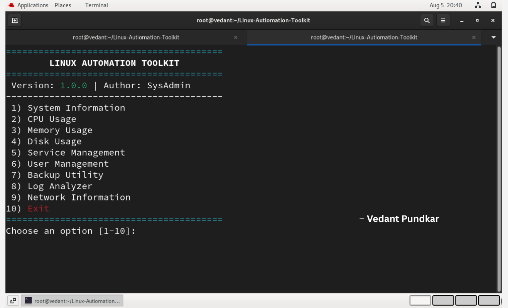

---

## 2. Folder Structure

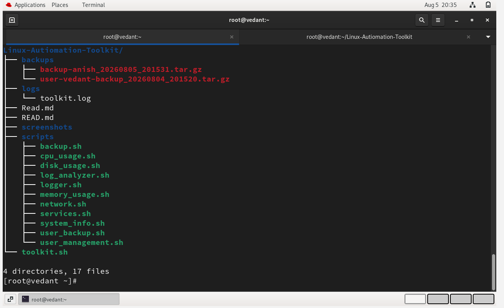

---

## 3. System Information

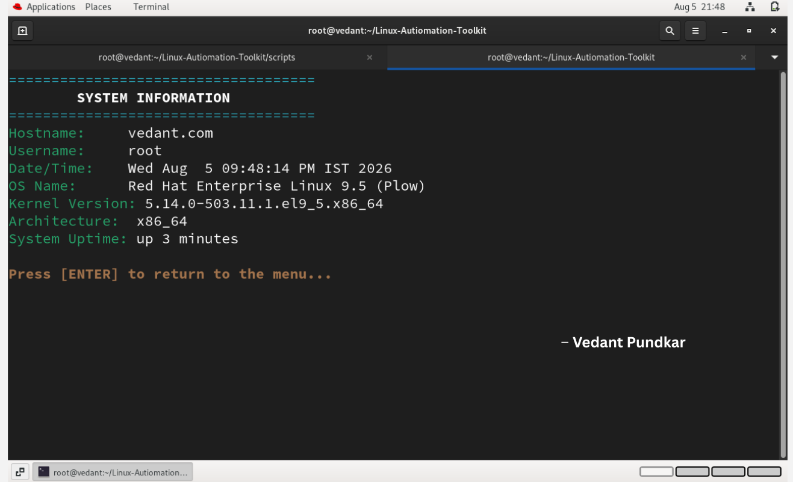

---

## 4. CPU Resource Usage

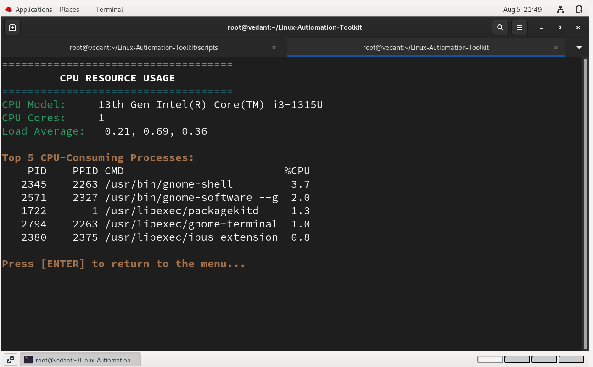

---

## 5. Memory Resource Usage

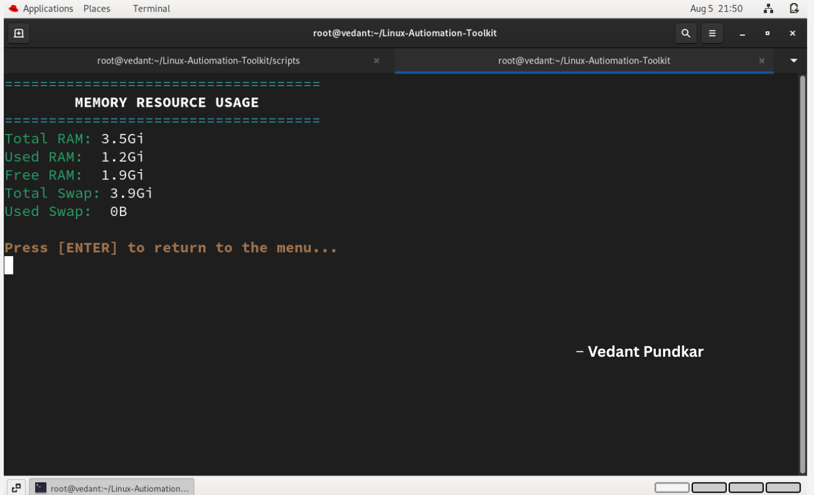

---

## 6. Disk Usage Overview

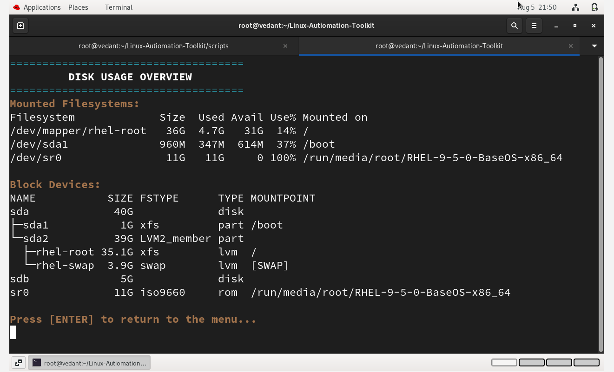

---

## 7. Service Management

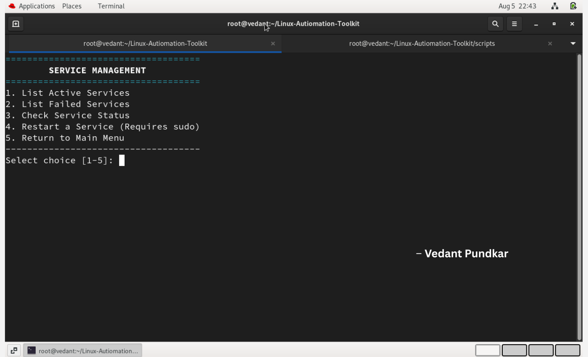

---

## 8. User Management

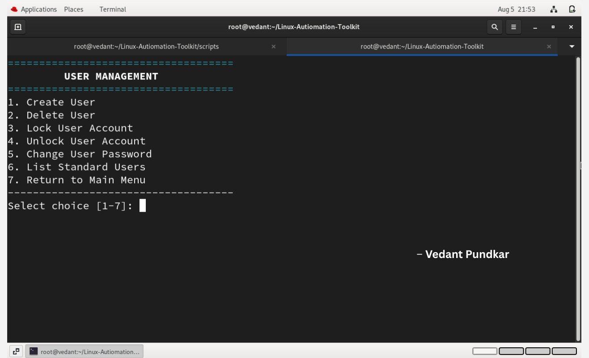

---

## 9. Backup Utility

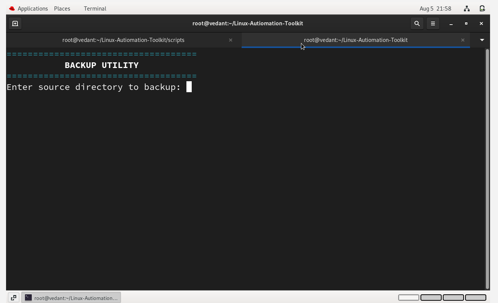

---

## 10. Log File Analyzer

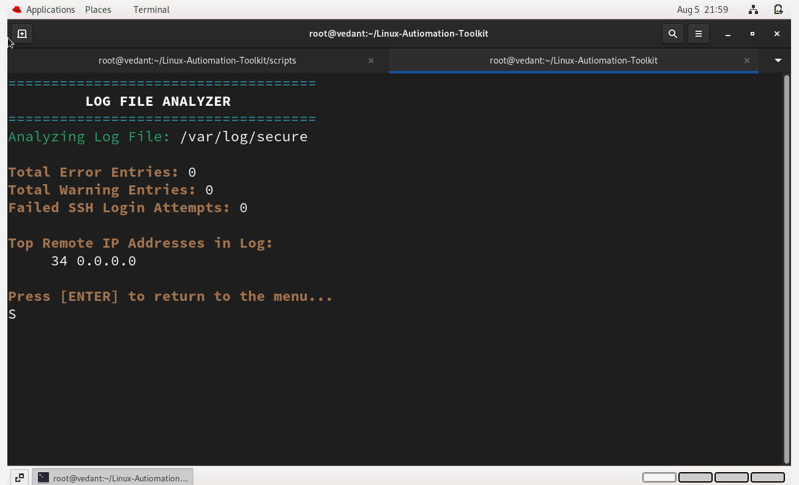

---

## 11. Centralized Logging

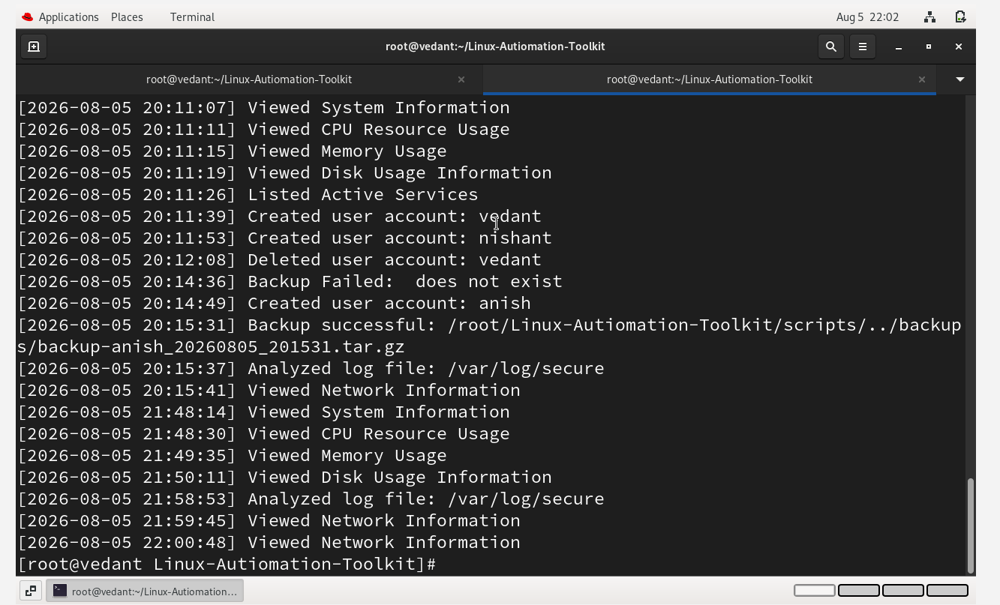

---

## 12. Network Information

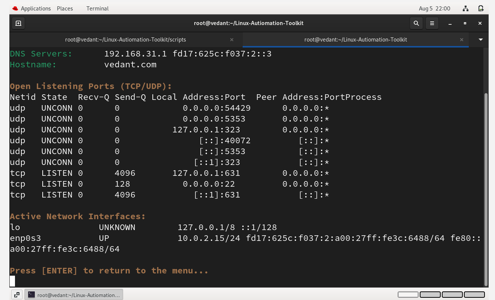

---

# 📋 Requirements

- Linux Operating System
- Bash Shell
- sudo Privileges
- Standard Linux Utilities

---

# 📚 Skills Demonstrated

- Bash Scripting
- Linux Administration
- Process Management
- User Management
- Service Management
- System Monitoring
- Backup Automation
- Log Analysis
- Networking
- File Management
- Shell Programming

---

# 🔮 Future Improvements

- Email Notifications
- Cron Job Scheduling
- Remote Server Monitoring
- Interactive Dashboard
- Performance Reports
- Configuration File Support

---

# 🎥 Demo

You can watch the project demo here:

LinkedIn: [https://www.linkedin.com/in/vedant-pundkar/]


https://github.com/user-attachments/assets/1e53116c-87fd-4521-b29f-2bf8aadec393


---

# 👨‍💻 Author

**Vedant**

Cloud & DevOps Enthusiast

LinkedIn: [https://www.linkedin.com/in/vedant-pundkar/]

GitHub: https://github.com/vedant-pundkar/

---

# 📄 License

This project is licensed under the MIT License.
